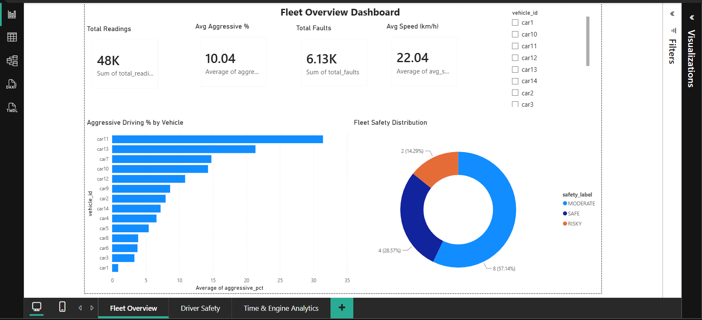
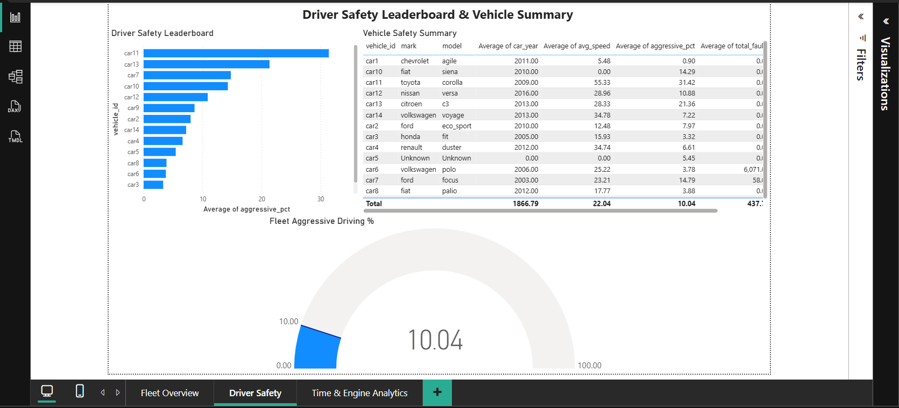
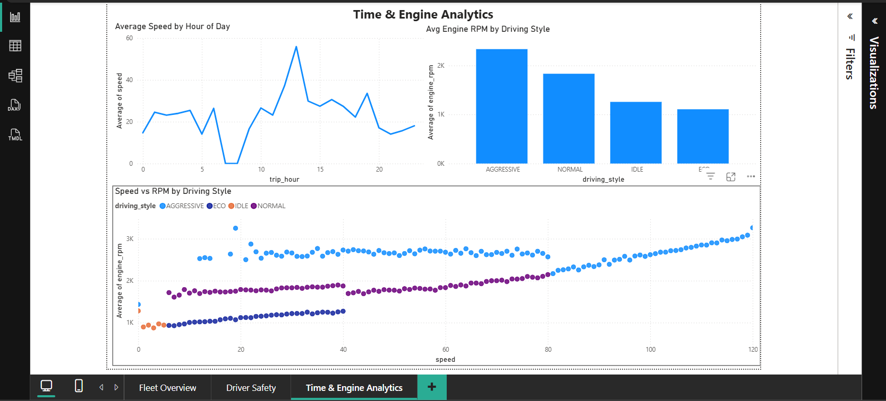

# 🚗 Vehicle Telematics Analytics — Driver Behaviour Classification & Safety Intelligence Pipeline

> Real-world OBD-II telematics data from 14 vehicles cleaned, analysed, 
> modelled, and visualised across Python, Excel, MySQL, and Power BI.
> Pipeline architecture directly transferable to EV connected vehicle systems.

---

## 📌 Project Overview

This project builds a complete driver behaviour intelligence pipeline using 
real OBD-II sensor data collected from 14 cars across daily driving routes. 
The pipeline classifies driving style (ECO / NORMAL / AGGRESSIVE / IDLE) and generates a safety score per vehicle — directly applicable to connected vehicle systems used in modern EV platforms where the same signals are streamed live from onboard sensors where the same signals (speed, motor RPM, throttle position, fault codes) are streamed live.

---

## 🗂️ Dataset

| Property | Value |
|---|---|
| Source | OBD-II Driving Behavior Dataset (Kaggle — cephasax) |
| Raw rows | 60,439 |
| Clean rows | 47,514 |
| Vehicles | 14 |
| Features | 30 columns |
| Collection | Real daily routes, Brazil, 2017 |

---

## 🛠️ Tech Stack


---

## 🔄 Pipeline Architecture

Raw CSV (60,439 rows — 33 cols — 18 mixed-type columns)

↓

Python / Pandas — Data Cleaning & Feature Engineering

↓

Clean CSV (47,514 rows — 30 cols — 0 nulls)

↓

Excel — EDA, Pivot Tables & Visualisation

↓

MySQL — Schema Design, Business Queries, Views, Stored Procedure

↓

ML — Random Forest, XGBoost, Safety Scoring

↓

Power BI — 3-page Interactive Dashboard

---

## 🧹 Data Cleaning Highlights

- Fixed **18 mixed-type columns** including % strings with European comma decimals
- Converted Unix millisecond timestamps to proper datetime
- Parsed DTC fault codes from freetext strings (`"MIL is OFF0 codes"` → integer)
- Capped impossible sensor outliers (speed > 120 km/h — 192 rows)
- Dropped **12,925 ghost rows** with no vehicle identity
- Engineered 4 new features: `DRIVING_STYLE`, `FAULT_COUNT`, `IS_IDLE`, `RPM_PER_SPEED`

---

## 📊 Excel EDA

| Sheet | Content |
|---|---|
| Raw_Data | Cleaned data + speed heatmap (green→yellow→red) |
| Pivot_DrivingStyle | Driving style count per vehicle + bar chart |
| Pivot_Faults | Fault count by vehicle — car6 = 6,071 faults |
| Chart_DrivingStyle | Donut chart — overall style distribution |

---

## 🗄️ MySQL

- **2 tables:** `vehicles` + `obd_readings` (47,514 rows imported)
- **8 business queries** including window functions, RANK(), and CASE statements
- **1 view:** `driver_safety_summary` — pre-computed safety metrics per vehicle
- **1 stored procedure:** `GetDriverScore(vehicle_id)` — returns full safety profile

```sql
-- Example: Get safety profile for any vehicle
CALL GetDriverScore('car11');
-- Returns: Toyota Corolla | Avg Speed 55.33 | Aggressive 31.42% | RISKY
```

---

## 🤖 Machine Learning

| Model | Target | Accuracy |
|---|---|---|
| Random Forest | Driving Style (4 classes) | 100% |
| XGBoost | Driving Style (4 classes) | 99.91% |
| Rule-based scoring | Safety Score (0–100) | — |

**Top 3 features:** `SPEED`, `ENGINE_RPM`, `RPM_PER_SPEED`

> **Note on 100% accuracy:** DRIVING_STYLE labels were rule-engineered 
> from the same features (speed + RPM thresholds). The model correctly 
> learned those rules back — validated with 5-fold cross validation. 
> In production, labels would come from human-annotated sessions.

---

## 📈 Power BI Dashboard

### Page 1 — Fleet Overview


### Page 2 — Driver Safety Leaderboard


### Page 3 — Time & Engine Analytics


---

## 🔑 Key Insights

- **car11 (Toyota Corolla 2009)** is the most aggressive driver — 31.42% aggressive readings
- **car6 (Volkswagen Polo)** has 6,071 fault events — needs immediate service
- **car1 (Chevrolet Agile)** is the safest driver — only 0.90% aggressive readings
- **57% of fleet is SAFE**, 28% MODERATE, 14% RISKY
- Aggressive driving peaks at **hour 13 (1PM)** and **hour 8 (8AM)**

---

## ⚡ Relevance to EV Connected Vehicle Systems

Although this dataset uses ICE vehicle OBD data, the pipeline is directly 
transferable to EV telematics systems:

| OBD Signal | EV Equivalent |
|---|---|
| Engine RPM | Motor RPM |
| Throttle position | Accelerator pedal input |
| Engine coolant temp | Motor/battery temperature |
| DTC fault codes | BMS fault codes |
| Battery voltage | HV battery pack voltage |

Modern connected EV scooters stream these exact signals live over 4G to their backend — this pipeline models how that data would be ingested, cleaned, analysed, and surfaced as rider-facing safety insights — this pipeline models how that data would be ingested, 
cleaned, analysed, and surfaced as rider-facing safety insights.

---

## 🚀 How to Run

```bash
# 1. Clone the repo
git clone https://github.com/YOUR_USERNAME/vehicle-telematics-driver-behaviour-analytics.git

# 2. Install dependencies
pip install -r requirements.txt

# 3. Run cleaning notebook
jupyter notebook notebooks/01_data_cleaning.ipynb

# 4. Run ML notebook
jupyter notebook notebooks/02_ml_model.ipynb

# 5. Import SQL schema
# Open MySQL Workbench → run sql/obd_queries.sql

# 6. Open Power BI dashboard
# Open powerbi/obd_driver_behavior_dashboard.pbix
```

---

## 📁 Project Structure

vehicle-telematics-driver-behaviour-analytics/

├── data/

│   ├── exp1_14drivers_14cars_dailyRoutes.csv  ← raw data

│   └── obd_cleaned.csv                        ← cleaned data

├── notebooks/

│   ├── 01_data_cleaning.ipynb

│   └── 02_ml_model.ipynb

├── sql/

│   └── obd_queries.sql

├── excel/

│   └── obd_driver_behavior_eda.xlsx

├── powerbi/

│   └── obd_driver_behavior_dashboard.pbix

├── plots/

│   ├── confusion_matrix.png

│   ├── feature_importance.png

│   ├── dashboard_page1.png

│   ├── dashboard_page2.png

│   └── dashboard_page3.png

├── requirements.txt

└── README.md

---

## 👤 Author

**AmalDev G S**
